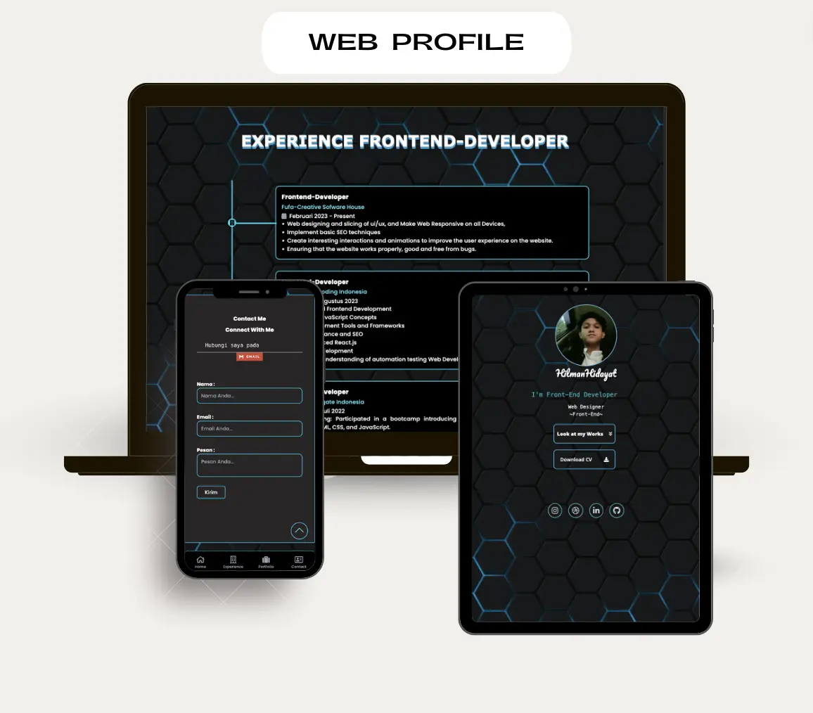

## Web Profile - Dokumentasi

## Documentasi demo

**Table of Contents**

- [Project Description:](#project-description)
- [Tech Stack:](#tech-stack)
- [Features:](#features)
- [Usage:](#usage)
- [Notes:](#notes)
- [Links:](#links)
  - [HTML:](#html)
  - [CSS:](#css)
  - [JavaScript:](#javascript)
  - [Animate.css:](#animate-css)
  - [Google Font:](#google-font)
- [Conclusion:](#conclusion)
- [References:](#references)

## Project Description

This web profile serves as an introduction to my skills, experience, and background. It's built using the following technologies:

- **HTML:** Provides the fundamental structure of the website.
- **CSS:** Styles the visual elements of the website.
- **SCSS:** Preprocessor for CSS, enabling modularity and improved organization.
- **Tailwind CSS:** Framework for rapid and efficient website development.
- **JavaScript:** Adds interactive features to the website.
- **Animate.css:** Library offering various CSS animations.
- **Google Font:** Integrates attractive and professional fonts.

## Tech Stack

- HTML5
- CSS3
- SCSS
- Tailwind CSS
- JavaScript
- Animate.css
- Google Fonts

## Features

The web profile offers various features, including:

- **Personal Description:** Provides information about myself, including education and work experience.
- **CV:** Downloadable resume in PDF format.
- **Contact:** Information for reaching out, including email, phone number, and social media links.
- **Experience:** Lists my work experiences.
- **Portfolio:** Showcases projects I've worked on.
- **Skills:** Highlights my skillset.
- **Certificates:** Displays my earned certificates.

## Usage

Navigating the web profile is straightforward. Utilize the navigation menu to explore different sections. You can also download my CV and explore project examples.

## Notes

This web profile is still under development, and I actively strive to add new features and enhance its quality.

## Links

- **Web Profile:** [https://web-profile-codeman.vercel.app/]

## Documentation

### HTML

- Serves as the website's foundational structure.
- Employs HTML5 for enhanced website structure.
- Utilizes semantic tags to facilitate search engine comprehension.

### CSS

- Responsible for the website's visual styling.
- Leverages CSS3 for advanced styling capabilities.
- Incorporates SCSS as a preprocessor for improved organization and modularity.
- Employs Tailwind CSS framework to streamline website development.

### JavaScript

- Introduces interactivity to the website.
- Utilized features include:
  - Navigation menu display
  - Animation implementation
  - Email sending functionality (if applicable)

### Animate.css

- Provides a library of CSS animations for visual appeal.
- Used for:
  - Loading screen animations
  - Scroll-triggered animations

### Google Font

- Integrates visually appealing and professional fonts.
- Used for:
  - Website title
  - Website content text

## Conclusion

This web profile serves as a platform to introduce myself, my skills, and my experience. It utilizes contemporary technologies and offers an intuitive user experience.

## References

- HTML Tutorial: [https://www.w3schools.com/html/](https://www.w3schools.com/html/)
- CSS Tutorial: [https://www.w3schools.com/css/](https://www.w3schools.com/css/)
- SCSS Tutorial: [https://sass-lang.com/](https://sass-lang.com/)
- Tailwind CSS Tutorial: [https://tailwindcss.com/](https://tailwindcss.com/)
- JavaScript Tutorial: [https://www.w3schools.com/js/](https://www.w3schools.com/js/)
- Animate.css: [https://daneden.github.io/animate.css/](https://daneden.github.io/animate.css/)
- Google Fonts: [https://fonts.google.com/](https://fonts.google.com/)
